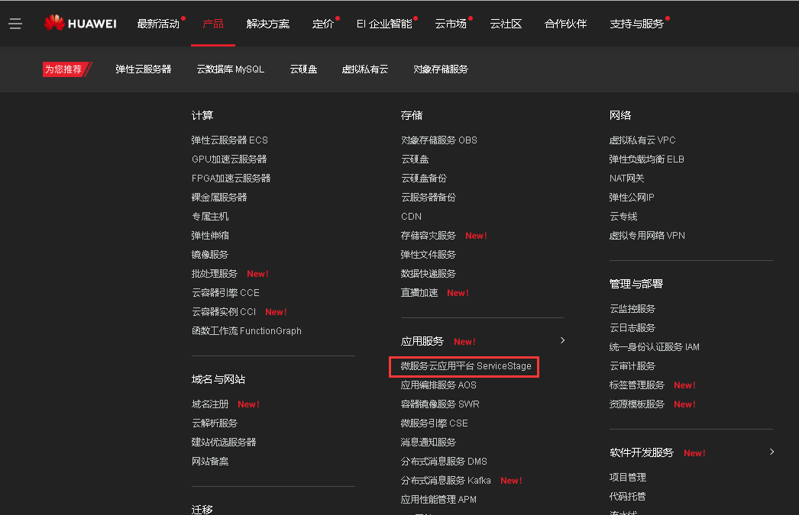
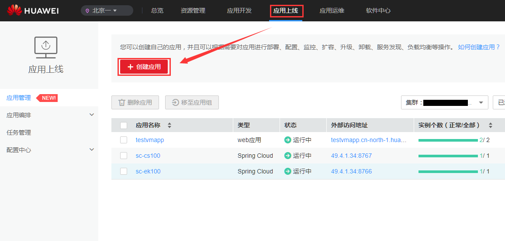
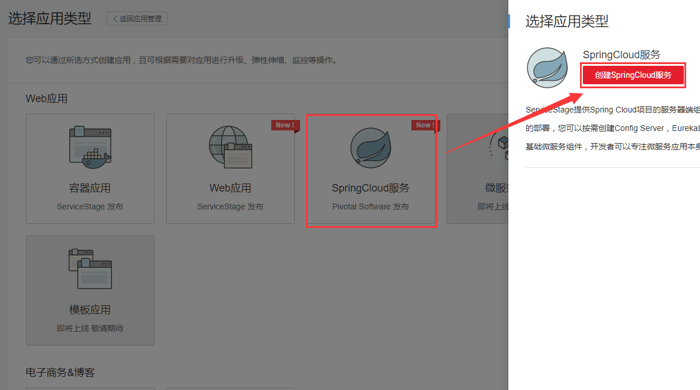
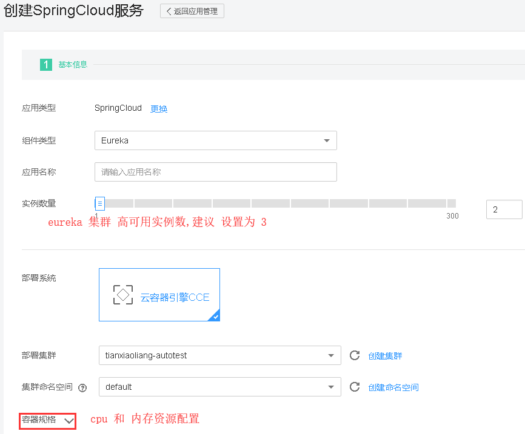
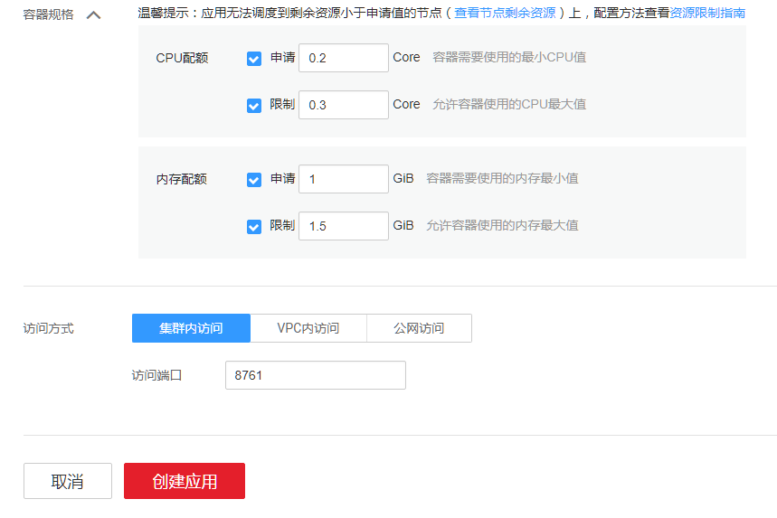
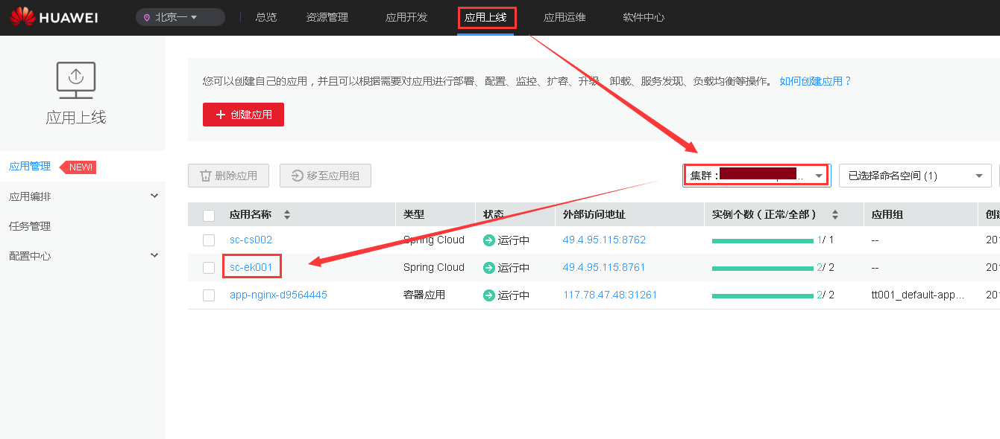
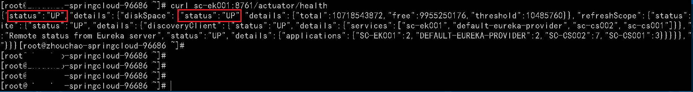

# springcloud-sample

华为云部署spring cloud物理多组 eureka 示例项目,该项目主要是讲述如何在华为云 ServiceStage 平台上部署 spring cloud eureka ,实现高可用.

## 使用华为云一键部署eureka高可用集群

* 登录华为微服务云应用平台[`ServiceStage` ](https://console.huaweicloud.com/servicestage)



* 进入ServiceStage, 在 ` 应用上线`界面,点击 `创建应用` 



* 选择 `SpringCloud 服务` 



* eureka 参数配置
  * 基本 参数 配置
  
  
  
  * 容器规格配置
  
  
  
 > **`资源配置`** , 仅做参考: 
 > * 搭建 `eureka` 高可用集群,建议 实例数设置为` 3 `
 >   1. 注册实例数 `500 以下` , CPU 申请 `0.1` 核, 限制 `0.2` 核 . 内存申请 `0.6` G 限制 `0.8` G 
 >   2. 注册实例数 `500 ~ 1000` , CPU 申请 `0.15` 核, 限制 `0.3` 核 . 内存申请 `0.8` G 限制 `1.0` G
 >   3. 注册实例数 `1000 ~ 2000` , CPU 申请 `0.3` 核, 限制 `0.5` 核 . 内存申请 `1.2` G 限制 `1.6` G
 > * 部署config server 高可用集群, 建议实例数量为 `2`
 >   1. CPU 申请 `0.1` 核, 限制 `0.2` 核 . 内存申请 `0.8` G 限制 `1.0` G
 > 
 > 企业有集群部署经验可以按照自己的经验,对上面数据进行修改, 还可以根据集群资源情况适当调整.
 >  
 > **`访问方式`** : 
 > 1. `集群内访问` : 只需要设置 `访问端口` , 默认只能在集群内部访问 该`高可用 eureka 集群`. 建议使用` curl http://${应用名称}:${访问端口}` 测试eureka 集群是否成功部署.
 >
 > 2. `VPC 内访问` : 需要指定一个负载均衡,目的是提供一个在 VPC 内能够访问的 IP, 这样在同一VPC 内的所有集群都可以通过负载均衡访问到 该 `高可用 eureka 集群`. 建议使用 `curl http://${vpc_ip}:${访问端口}` 测试eureka集群是否成功部署.
 >
 > 3. `公网访问`: 类似 `VPC内访问`,需要指定负载均衡,只不过该负载均衡在公网也能被访问到. 其他类似 `VPC内访问` .
 
*  `创建应用` > `返回应用列表` , 查看自己部署的 eureka 集群, 注意 eureka 集群启动的时候较为缓慢,由于eureka 部署的时候安装了 `探针` 功能, 而实例的启动时间无法精确指定,所以在启动之前.实例列表会显示 `实例异常`,并不影响运行,第一个实例启动时间大约为 `一分半` ,启动成功后,该实例会显示`运行中`,然后启动第二个实例,直到所有的实例启动成功. 
 
 
 
## 验证 erueka 高可用集群:

* **集群内访问**: 



Notes: 建议使用 服务名+ 端口的访问方式.  

* **VPC内 访问** :


* **公网访问** :


## 本地SpringCloud应用接入云上eureka集群

本例演示了2个本地SpringCloud应用[**eureka-client-provider**](/eureka-client-provider)(服务提供者)
和[**eureka-client-consumer-feign**](/eureka-client-consumer-feign)(服务消费者)
如何通过公网访问的`eureka`集群实现服务注册和服务发现.

#### 启动服务提供者

本例中的服务提供者默认监听本机端口`8776`

```bash
cd eureka-client-provider
mvn clean install
java -Deureka.client.service-url.defaultZone=http://{eureka外部访问地址}/eureka/ -jar target/eureka-client-provider-0.0.1-SNAPSHOT.jar 
```

#### 启动服务消费者

本例中的服务消费者默认监听本机端口`8778`

```bash
cd eureka-client-consumer-feign
mvn clean install
java -Deureka.client.service-url.defaultZone=http://{eureka外部访问地址}/eureka/ -jar target/eureka-client-consumer-feign-0.0.1-SNAPSHOT.jar 
```

#### 发起请求调用服务消费者

```bash
curl -s http://127.0.0.1:8778/sayHello
# hello, huawei. There is cse with port : 8776
```

Notes: 以上服务消费者借助Feign能力调用服务提供者的接口,如果习惯使用RestTemplate,这里提供另一种实现[**eureka-client-consumer-ribbon**](/eureka-client-consumer-ribbon) 

## enjoy your eureka cluster ! 
