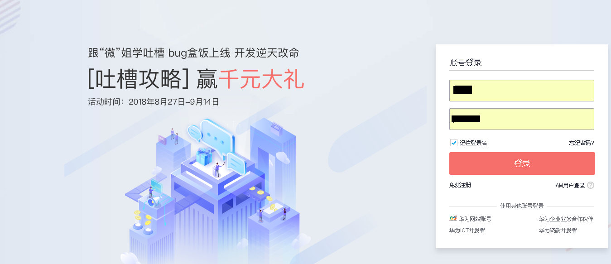
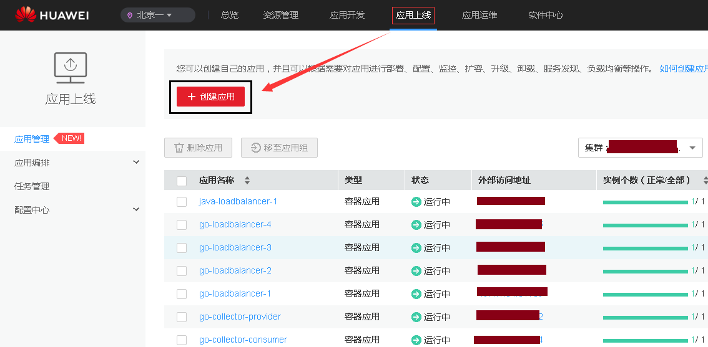
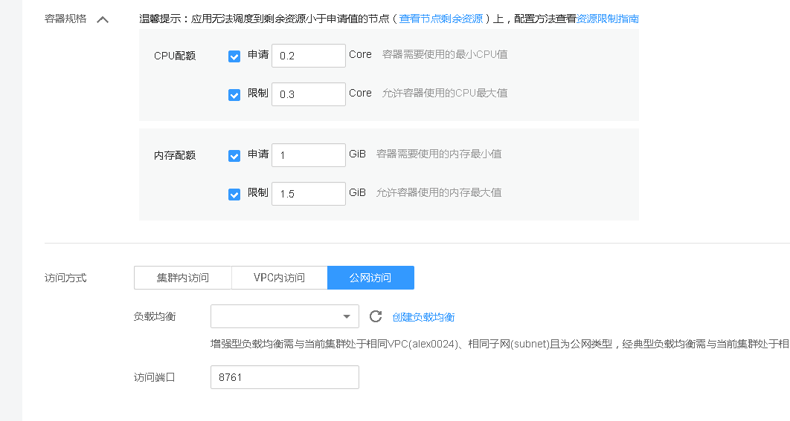
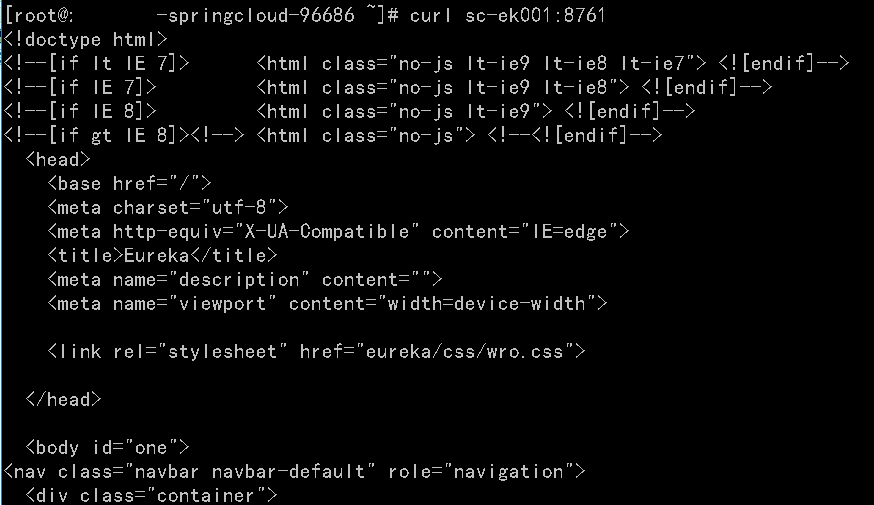
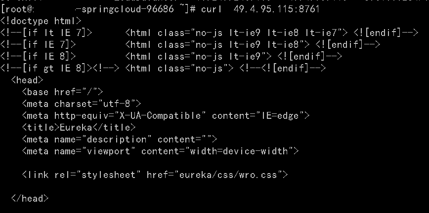
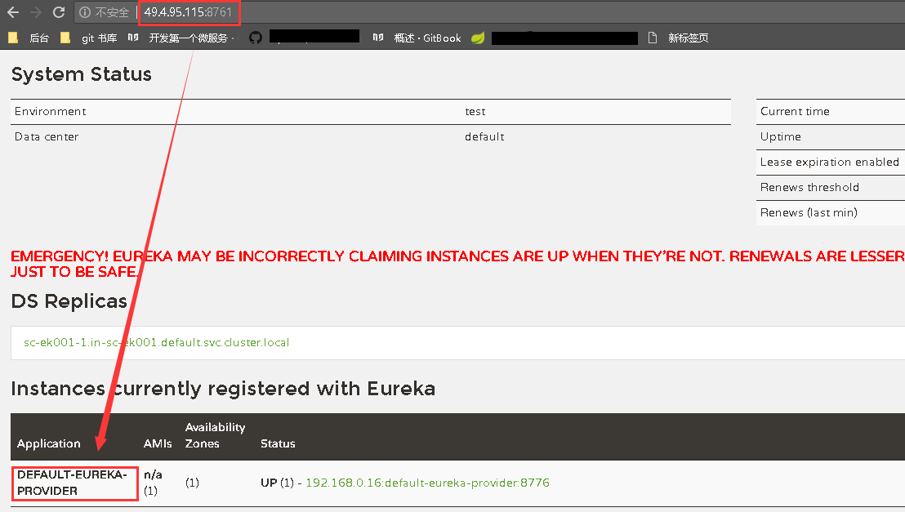
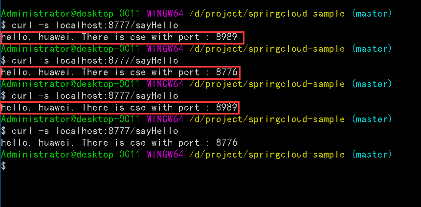
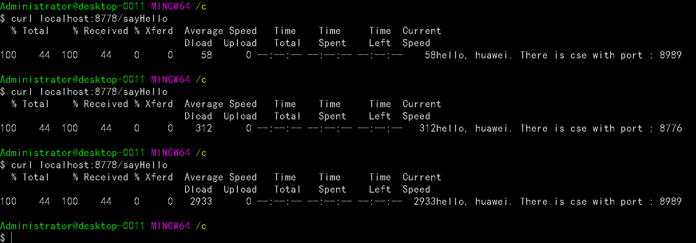

# springcloud-sample

华为云部署spring cloud物理多组 eureka 示例项目,该项目主要是讲述如何在华为云 ServiceStage 平台上部署 spring cloud eureka ,实现高可用.

## 华为云 部署eureka 集群

### 创建eureka 集群
* 登录华为云账号



* 进入`ServiceStage` 应用平台


* 进入ServiceStage, 在 ` 应用上线`界面,点击 `创建应用` 



* 选择 `SpringCloud 服务` 


* eureka 参数配置
  * 基本 参数 配置
  
  
  
  * 容器规格配置
  
  
  
 > **`资源配置`** , 仅做参考: 
 > * 搭建 `eureka` 高可用集群,建议 实例数设置为` 3 `
 >   1. 注册实例数 `500 以下` , CPU 申请 `0.1` 核, 限制 `0.2` 核 . 内存申请 `0.6` G 限制 `0.8` G 
 >   2. 注册实例数 `500 ~ 1000` , CPU 申请 `0.15` 核, 限制 `0.3` 核 . 内存申请 `0.8` G 限制 `1.0` G
 >   3. 注册实例数 `1000 ~ 2000` , CPU 申请 `0.3` 核, 限制 `0.5` 核 . 内存申请 `1.2` G 限制 `1.6` G
 > * 部署config server 高可用集群, 建议实例数量为 `2`
 >   1. CPU 申请 `0.1` 核, 限制 `0.2` 核 . 内存申请 `0.8` G 限制 `1.0` G
 > 
 > 企业有集群部署经验可以按照自己的经验,对上面数据进行修改, 还可以根据集群资源情况适当调整.
 >  
 > **`访问方式`** : 
 > * `集群内访问` : 只需要设置 `访问端口` , 默认只能在集群内部访问 该`高可用 eureka 集群`. 建议使用` curl http://${应用名称}:${访问端口}` 测试eureka 集群是否成功部署.
 >
 > 
 >
 > * `VPC 内访问` : 需要指定一个负载均衡,目的是提供一个在 VPC 内能够访问的 IP, 这样在同一VPC 内的所有集群都可以通过负载均衡访问到 该 `高可用 eureka 集群`. 建议使用 `curl http://${vpc_ip}:${访问端口}` 测试eureka集群是否成功部署.
 >
 > 
 >
 > * `公网访问`: 类似 `VPC内访问`,需要指定负载均衡,只不过该负载均衡在公网也能被访问到. 其他类似 `VPC内访问` .
 
*  `创建应用` > `返回应用列表` , 查看自己部署的 eureka 集群, 注意 eureka 集群启动的时候较为缓慢,由于eureka 部署的时候安装了 `探针` 功能,所以在启动之前, 探针会显示 `实例异常`,并不影响运行,第一个实例启动时间大约为 `一分半` ,启动成功后,该实例会显示`运行中`,然后启动第二个实例,直到所有的实例启动成功. 
 
 

### 配置 eureka-client-provider
 建议结合源码 `https://github.com/heyile/springcloud-sample`
* 新建 maven 项目, 依赖如下

```xml
  <properties>
    <project.build.sourceEncoding>UTF-8</project.build.sourceEncoding>
    <project.reporting.outputEncoding>UTF-8</project.reporting.outputEncoding>
    <java.version>1.8</java.version>
    <spring-cloud.version>Finchley.SR1</spring-cloud.version>
  </properties>

  <dependencies>
    <dependency>
      <groupId>org.springframework.cloud</groupId>
      <artifactId>spring-cloud-starter-netflix-eureka-client</artifactId>
    </dependency>
    <dependency>
      <groupId>org.springframework.boot</groupId>
      <artifactId>spring-boot-starter-web</artifactId>
    </dependency>
    <dependency>
      <groupId>org.springframework.boot</groupId>
      <artifactId>spring-boot-starter-test</artifactId>
      <scope>test</scope>
    </dependency>
  </dependencies>
```
* 配置 application.yaml 

```yaml
server:
  port: ${SERVER_PORT: 8989}
spring:
  application:
    name: default-eureka-provider
eureka:
  client:
    serviceUrl:
      defaultZone: http://49.4.95.115:8761/eureka/ # 如果是集群内部建议使用 http://sc-ek001:8761/eureka/
    fetch-registry: false
  instance:
    prefer-ip-address: true

```

* 添加注解 `@EnableEurekaClient`

```java

@EnableEurekaClient
@SpringBootApplication
public class EurekaClientProviderApplication {

  public static void main(String[] args) {
    SpringApplication.run(EurekaClientProviderApplication.class, args);
  }
}

```
* 添加示例 controller

```java
@RestController
public class EurekaSampleController {

  @Value("${server.port}")
  String port;

  @RequestMapping(value = "/sayHello",method = RequestMethod.GET)
  public String hello(){
    return "hello, huawei. There is cse with port : " + port ;
  }
}

```

* 启动该项目,可以去 eureka 查看实例注册情况.



### 配置 eureka-client-consumer
* rest + ribbon 配置消费者, 对应模块 `eureka-client-consumer-ribbon`
  * 新建maven 项目,依赖如下: 
  ```xml
    <properties>
      <project.build.sourceEncoding>UTF-8</project.build.sourceEncoding>
      <project.reporting.outputEncoding>UTF-8</project.reporting.outputEncoding>
      <java.version>1.8</java.version>
      <spring-cloud.version>Finchley.SR1</spring-cloud.version>
    </properties>
  
    <dependencies>
  
      <dependency>
        <groupId>org.springframework.cloud</groupId>
        <!--默认已经集成了 spring-cloud-starter-netflix-ribbon-->
        <artifactId>spring-cloud-starter-netflix-eureka-client</artifactId>
      </dependency>
    <dependency>
      <groupId>org.springframework.boot</groupId>
      <artifactId>spring-boot-starter-web</artifactId>
    </dependency>
    <dependency>
      <groupId>org.springframework.boot</groupId>
      <artifactId>spring-boot-starter-test</artifactId>
      <scope>test</scope>
    </dependency>
  </dependencies>
  ```
  *  配置 application.yaml
  ```yaml
  server:
    port: 8777
  spring:
    application:
      name: consumer-ribbon
  
  eureka:
    client:
      service-url:
        defaultZone: http://49.4.95.115:8761/eureka/
      fetch-registry: true
      register-with-eureka: false # consumer 不需要把自己注册到 eureka server
  ```
  * 配置 全局 config, 开启服务负载均衡
  
  ```java
  @Component
  @Configuration
  public class WebConfig {
  
    @Bean
    @LoadBalanced
    public RestTemplate restTemplate() {
      return new RestTemplate();
    }
  
  }
  ```
  
  * 添加注解 `@EnableEurekaClient`
  
  ```java
  
  @EnableEurekaClient
  @SpringBootApplication
  public class EurekaClientConsumerRibbonApplication {
  
    public static void main(String[] args) {
      SpringApplication.run(EurekaClientConsumerRibbonApplication.class, args);
    }
  }
  ```
  
  * 添加示例 consumer,调用 provider 提供的 `sayHello()`
  ```java
  @RestController
  public class EurekaClientSample {
  
    @Autowired
    private RestTemplate restTemplate;
  
    private static final String PROVIDER_HELLO_URL_PREFIX = "http://default-eureka-provider";
  
    @RequestMapping("/sayHello")
    public String sayHello() {
      String url = PROVIDER_HELLO_URL_PREFIX + "/sayHello";
      String hello = restTemplate.getForObject(url, String.class);
  
      return hello == null ? "ERROR" : hello;
    }
  }
  ```
  
  * 启动消费者,并且测试 轮询机制. ps: 要启动两个provider 才能测试 Ribbon 简单的轮询负载均衡,对应源码中的模块 `eureka-client-provider` 和 `eureka-client-provider-copy`
  
  

* feign 注解配置消费者
  * 新建 maven 项目配置依赖
  ```xml
  <properties>
    <project.build.sourceEncoding>UTF-8</project.build.sourceEncoding>
    <project.reporting.outputEncoding>UTF-8</project.reporting.outputEncoding>
    <java.version>1.8</java.version>
    <spring-cloud.version>Finchley.SR1</spring-cloud.version>
  </properties>

  <dependencies>
    <dependency>
      <groupId>org.springframework.cloud</groupId>
      <artifactId>spring-cloud-starter-netflix-eureka-client</artifactId>
    </dependency>
    <dependency>
      <groupId>org.springframework.cloud</groupId>
      <artifactId>spring-cloud-starter-openfeign</artifactId>
    </dependency>
    <dependency>
      <groupId>org.springframework.boot</groupId>
      <artifactId>spring-boot-starter-web</artifactId>
    </dependency>
    <dependency>
      <groupId>org.springframework.boot</groupId>
      <artifactId>spring-boot-starter-test</artifactId>
      <scope>test</scope>
    </dependency>
  </dependencies>
  ```
  * 配置 `application.yaml`
  
  ```yaml
  server:
    port: 8778
  spring:
    application:
      name: consumer-feign
  
  eureka:
    client:
      service-url:
        defaultZone: http://49.4.95.115:8761/eureka/
      fetch-registry: true
      register-with-eureka: false
  ```
  
  * 增加注解 `@EnableFeignClients` ,开启 Feign 功能
  ```java
  @EnableEurekaClient
  @EnableFeignClients
  @SpringBootApplication
  public class EurekaClientConsumerFeignApplication {
  
    public static void main(String[] args) {
      SpringApplication.run(EurekaClientConsumerFeignApplication.class, args);
    }
  }
  ```
  * 增加 服务消费者示例
  
  **HelloWorldIntf.java**
  
  ```java
  
  @FeignClient("default-eureka-provider")
  public interface HelloWorldIntf {
  
    @RequestMapping(value = "/sayHello",method = RequestMethod.GET)
    String sayHello();
  
  }
  ```
  
  **HelloWorldService.java**
  
  ```java
  
  @Service
  public class HelloWorldService {
  
    @Autowired
    HelloWorldIntf helloWorldIntf;
  
    @RequestMapping("/sayHello")
    public String sayHello() {
      String result = helloWorldIntf.sayHello();
      return result == null ? "ERROR" : result;
    }
  }

  ```
  **ConsumerSampleController.java**
  ```java
  @RestController
  public class ConsumerSampleController {
    @Autowired
    HelloWorldService helloWorldService;
  
    @GetMapping("/sayHello")
    public String sayHello() {
      return helloWorldService.sayHello();
    }
  }
  ```
  * 启动 feign 消费者,并且测试.
  
  
  
## **enjoy your eureka cluster** 
