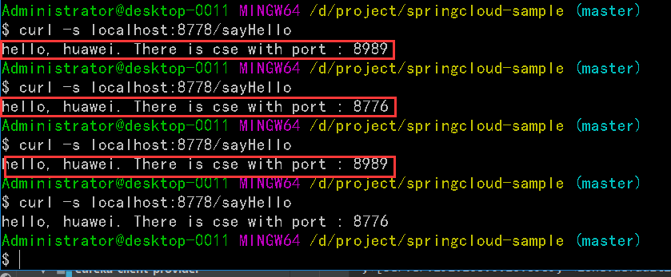

# 配置 eureka-client-consumer
使用华为云 `eureka 高可用集群`, feign 注解配置消费者

  * 新建 maven 项目配置依赖
  ```xml
  <properties>
    <project.build.sourceEncoding>UTF-8</project.build.sourceEncoding>
    <project.reporting.outputEncoding>UTF-8</project.reporting.outputEncoding>
    <java.version>1.8</java.version>
    <spring-cloud.version>Finchley.SR1</spring-cloud.version>
  </properties>

  <dependencies>
    <dependency>
      <groupId>org.springframework.cloud</groupId>
      <artifactId>spring-cloud-starter-netflix-eureka-client</artifactId>
    </dependency>
    <dependency>
      <groupId>org.springframework.cloud</groupId>
      <artifactId>spring-cloud-starter-openfeign</artifactId>
    </dependency>
    <dependency>
      <groupId>org.springframework.boot</groupId>
      <artifactId>spring-boot-starter-web</artifactId>
    </dependency>
    <dependency>
      <groupId>org.springframework.boot</groupId>
      <artifactId>spring-boot-starter-test</artifactId>
      <scope>test</scope>
    </dependency>
  </dependencies>
  ```
  * 配置 `application.yaml`
  
  ```yaml
  server:
    port: 8778
  spring:
    application:
      name: consumer-feign
  
  eureka:
    client:
      service-url:
        defaultZone: http://49.4.95.115:8761/eureka/
      fetch-registry: true
      register-with-eureka: false
  ```
  
  * 增加注解 `@EnableFeignClients` ,开启 Feign 功能
  ```java
  @EnableEurekaClient
  @EnableFeignClients
  @SpringBootApplication
  public class EurekaClientConsumerFeignApplication {
  
    public static void main(String[] args) {
      SpringApplication.run(EurekaClientConsumerFeignApplication.class, args);
    }
  }
  ```
  * 增加 服务消费者示例, 调用 provider 提供的 `sayHello()`
  
  **HelloWorldIntf.java**
  
  ```java
  
  @FeignClient("default-eureka-provider")
  public interface HelloWorldIntf {
  
    @RequestMapping(value = "/sayHello",method = RequestMethod.GET)
    String sayHello();
  
  }
  ```
  
  **HelloWorldService.java**
  
  ```java
  
  @Service
  public class HelloWorldService {
  
    @Autowired
    HelloWorldIntf helloWorldIntf;
  
    @RequestMapping("/sayHello")
    public String sayHello() {
      String result = helloWorldIntf.sayHello();
      return result == null ? "ERROR" : result;
    }
  }

  ```
  **ConsumerSampleController.java**
  ```java
  @RestController
  public class ConsumerSampleController {
    @Autowired
    HelloWorldService helloWorldService;
  
    @GetMapping("/sayHello")
    public String sayHello() {
      return helloWorldService.sayHello();
    }
  }
  ```
  * 启动 feign 消费者,并且测试.
  
  
